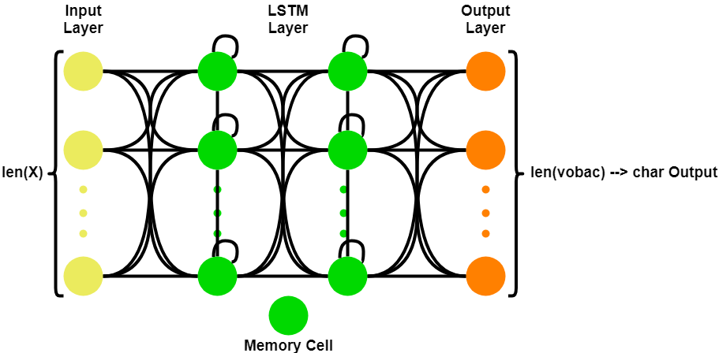

# TensorFlow_TextGenerator
A Text-Generator that uses TensorFlow to train a LSTM model for a given text file and generates text in that style by predicting single chars for a desired text length.
This code was created as a private project while learning machine learning concepts. Therefore not everything is perfectly implemented and fully configurable, but has enough possibilities to play around and experiment with different settings. 
Free ebooks to use as input dataset can for example be found at the awesome [Project Gutenberg](https://www.gutenberg.org/).

The architecture of the used Neural Network (NN) looks like this:

Caveat: The Dropout is not visualized here!

## Quick Start
1. Download this repository as .zip or via git clone
2. Install requirements: ``` pip install -r stable-req.txt ``` (requirements were generated using ``` pip freeze ```)
3. Add a text file to data (don't forget to remove header and footer e.g. used in Project Gutenberg files)
4. Edit the [config.json](config.json) file accordingly
5. Start the generator (with preprocessing, training and generation if it's your first start) using ``` python generator.py ```

After your first training you can use the previously trained checkpoints to just generate data.
Therefore edit the [config.json](config.json) file:
* Disable preprocessing (```exec_preprocessing``` to ```false```) and training (```exec_training``` to ```false```)
* Set the weights to use to the weights checkpoint (```load_weights_filename```) using the lowest loss X in epoch Y (```trainingsCheckpoints/weights_ep_YYY-loss_X.XXX.hdf5```)
* Enable generation (```exec_generation``` to ```true```)
* Execute ```python generator.py```

## Configuration
The most relevant parameters and settings are configurable via the [config.json](config.json) file.
For most scenarios you don't actually have to edit the code yourself, just the config.

* __preprocessing__: Parameters specific to the preprocessing phase
  * __exec_preprocessing__: Whether preprocessing should be exectued or not
  * __input_file__: The file to use as input data
  * __sequence_chars_length__: The length of the text sequence to extract the patterns from (sequence -> predicted next char)
  * __checkpoints__:
    * __char2intDict_file__: The file holding the checkpoint for the dictionary that converts chars to integers
    * __int2charDict_file__: The file holding the checkpoint for the dictionary that converts integers to chars
    * __vocabulary_file__: The file holding the extracted vocabulary (unique chars)
    * __X_file__: The input matrix
    * __Y_file__: The output matrix (next char)
* __training__: Parameters specific to the training phase
  * __exec_training__: Whether training should be exectued or not
  * __load_weights_filename__: If training should not be extecuted, previously trained weights are loaded from this file
  * __lstm_units__: Dimensionality of the output space
  * __dropout_probability__: The probability of a dropout between 0 and 1
  * __epochs_qty__: The amount of epochs to execute while training
  * __batch_size__: Number of samples per gradient update
  * __checkpoints__:
    * __foldername__: The folder where the weights should be stored
* __generation__:
  * __exec_generation__: Whether generation should be exectued or not
  * __text_chars_length__: The length of the text in chars that should be generated
  * __foldername__: The folder where the resulting generated text should be stored
  
## Class Overview
* __generator.py__: The class that generates text, also includes the main-function
* __preprocessing.py__: The class that encapsulates the preprocessing phase
* __training.py__: The class that encapsulates the training phase
* __filehelper.py__: The helper class that handles all file specific tasks (e.g. read/write checkpoints, loading config etc.)

## Example Result
Using this configuration:
```
{
    "preprocessing": {
        "exec_preprocessing": true,
        "input_file": "data/aliceInWonderland.txt",
        "sequence_chars_length": 100,
        "checkpoints": {
            "char2intDict_file": "preprocessingCheckpoints/char2intDict",
            "int2charDict_file": "preprocessingCheckpoints/int2charDict",
            "vocabulary_file": "preprocessingCheckpoints/vocab",
            "X_file": "preprocessingCheckpoints/X",
            "Y_file": "preprocessingCheckpoints/Y"
        }
    },
    "training": {
        "exec_training": true,
        "load_weights_filename": "trainingCheckpoints/weights-ep_10-loss_2.1012.hdf5",
        "lstm_units": 256,
        "dropout_probability": 0.2,
        "epochs_qty": 10,
        "gradient_batch_size": 128,
        "checkpoints":{
            "foldername": "trainingCheckpoints"
        }
    },
    "generation": {
        "exec_generation": true,
        "text_chars_length": 1000,
        "foldername": "result"
    }
}


```

and a random seed, this output could be generated:

```
‘i dan a latter ’ said the date pirelee to aerce an an anine  ‘in
the koot oo the woile ’ and the woile worhe to the worle to ber toee
ano the woole  an anl the woole  and toee
‘i can a latter ’ said the doyphon, ‘i wonld to toe toee ’
```

Obviously this is no perfect english and doesn't really make sense.
But regarding that the NN had no prior knowledge about languages, terms, or even that you use high quotes for indicating that someone said something, it learned in a really short time (just 10 epochs) how the main structure of text should look like.

If you would further tune the parameters you would get way better results than that.
But for a basic tutorial and first hands on, I think this should be enough.
